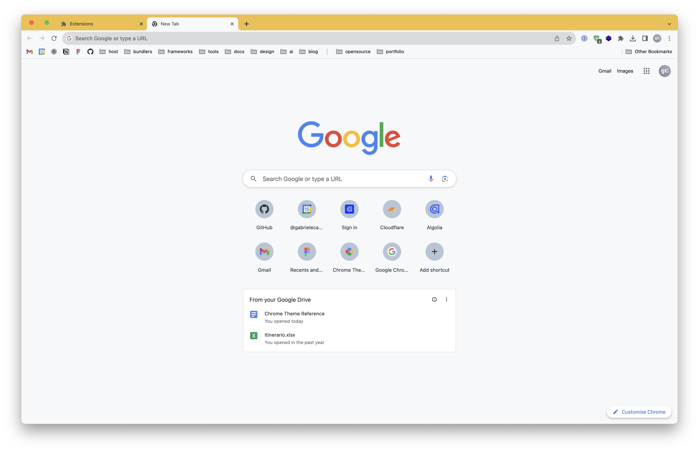
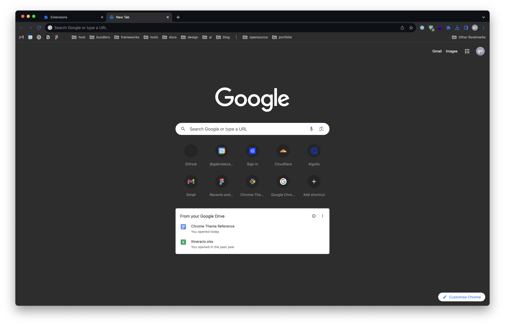
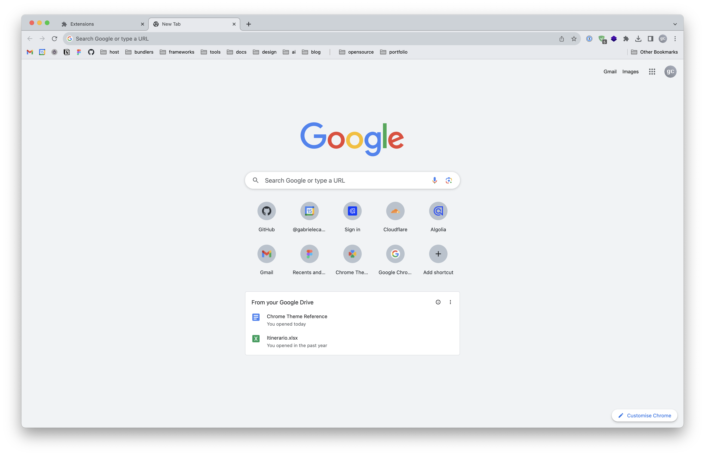
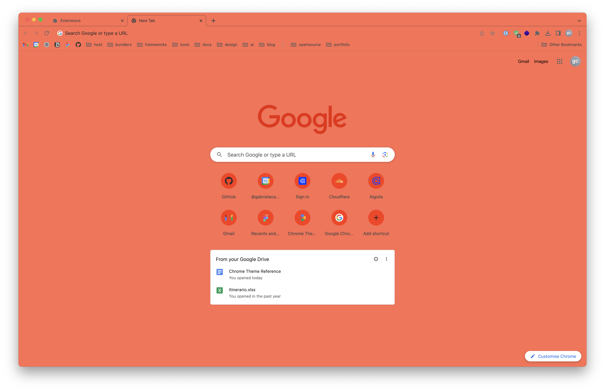

# Chrome Themes

- [Available themes](#available-themes)
  - [Banana](#banana)
  - [GitHub Dark](#github-dark)
  - [GitHub Light](#github-light)
  - [Sienna](#sienna)
- [Installation](#installation)
- [Development](#development)

## Available themes

### Banana

### GitHub Dark

### GitHub Light

### Sienna

## Installation

Head over to `chrome://extensions` and enable the developer mode, then click on _Load unpacked_ and select the folder of the theme to install.

On every load, a `Cached Theme.pak` file will be created in the theme folder. This file is not needed for the theme to work, but it will speed up the loading time. To reflect new changes made to the theme, delete this file and reload the extension.

## Development

The file [`manifest.jsonc`](assets/manifest.jsonc) contains all available options for a theme.

For more information, refer to the [official documentation](https://developer.chrome.com/docs/extensions/mv3/themes) and this [themes guide](https://docs.google.com/document/d/1jt9vdUY9O5IMm6Zoi2Kz0LWFfFZpvP69qjy6PoGsEoA).

