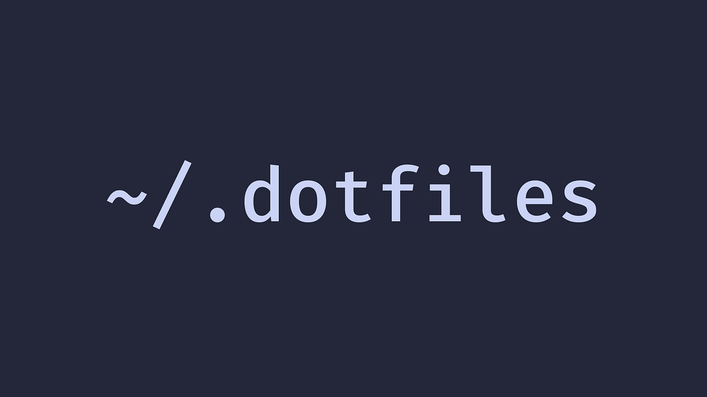

> [!WARNING]
> Before using the following dotfiles, fork this repository, review the content and remove things you don’t want or need. **Don’t blindly use my settings** unless you know what you are doing. Use at your own risk.

## Features

#### Version-controlled home directory

`~` is version-controlled. The [`.gitignore`](/.gitignore) acts as an allowlist, so files are tracked only once opted-in and nothing leaks in by accident. Git hooks run natively, with no extra tooling.

#### Single script to install everywhere

[`install.sh`](/.github/install.sh) clones the repo, copies every managed file into the home, and sets up Homebrew, runtimes, packages, and all other managed tools. It confirms before overwriting and backs up whatever it replaces, so re-runs are safe.

#### Synced Brewfile to manage all dependencies

[`Brewfile`](/.homebrew/Brewfile) pins formulae, casks, App Store apps and VS Code extensions. The wrapped `brew` command keeps it always in sync, and `brew fresh` updates, upgrades, cleans, dumps, and runs health checks in one go.

#### Fast and powerful shell configuration

Oh My Zsh runs alongside local plugins and themes under [`.zsh`](/.zsh). Plugins extend the shell with guided profile setup, runtime version switching and LTS installation, completions, and more. The custom `squanchy` theme displays active runtime versions and symbols for available LTS upgrades.

#### Pinned runtimes and dependencies

Node, Ruby, and Python are pinned through nodenv, rbenv, and pyenv. The version managers read the tracked `.node-version`, `.ruby-version`, and `.python-version` files, so the machine and repos stay on the same versions.

#### Single source of truth for AI agents

The [`.agents`](/.agents) directory holds instructions, rules, and skills shared by Claude Code, Codex, and Copilot. Each tool's own config is a symlink into the folder, all three read the same source and never drift.

#### Extended synchronization

On macOS, VS Code keybindings, settings, and snippets are symlinked back into the repository, with `Downloads`, `Movies`, and `Music` being linked to iCloud Drive for continuous sync across machines.

## Installation

Run the install script to bootstrap the configuration:

```sh
sh -c "$(curl -fsSL https://raw.githubusercontent.com/gabrielecanepa/dotfiles/main/.github/install.sh)"
```

The script runs the following main actions:

1. Installs the configuration by shallow-cloning this repository into a temporary directory (removed automatically on exit, error or interrupt) and copying each managed file into the home directory
2. Backs up the replaced files into a timestamped backup folder in the default state directory
3. Sets up Homebrew, packages, Oh My Zsh, runtimes, global dependencies, macOS defaults, Visual Studio Code, and iCloud symlinks

## Manual Setup

- [SSH](#ssh)
- [Homebrew](#homebrew)
- [Oh My Zsh](#oh-my-zsh)
- [Dotfiles](#dotfiles)
- [Git](#git)
- [Shell Profile](#shell-profile)
- [Runtimes](#runtimes)
  - [Node.js](#nodejs)
  - [Ruby](#ruby)
  - [Python](#python)
- [Visual Studio Code](#visual-studio-code)
  - [Keybindings](#keybindings)
- [iCloud](#icloud)

### SSH

If not already present, generate a new SSH key and copy it to the clipboard:

```sh
ssh-keygen -t ed25519 -C "<comment>"
tr -d '\n' < ~/.ssh/id_ed25519.pub | pbcopy
```

Add the key to [GitHub](https://github.com/settings/ssh/new), [GitLab](https://gitlab.com/-/profile/keys) and any other services you use.

### Homebrew

Install Homebrew:

```sh
/bin/bash -c "$(curl -fsSL https://raw.githubusercontent.com/Homebrew/install/HEAD/install.sh)"
```

### Oh My Zsh

Install Oh My Zsh and some useful plugins from [zsh-users](https://github.com/zsh-users):

```sh
/bin/bash -c "$(curl -fsSL https://raw.github.com/ohmyzsh/ohmyzsh/HEAD/tools/install.sh)"

plugins=(
  zsh-autosuggestions
  zsh-completions
  zsh-syntax-highlighting
)

for plugin in ${plugins[@]}; do
  git clone https://github.com/zsh-users/${plugin}.git ${ZSH_CUSTOM:-~/.oh-my-zsh/custom}/plugins/${plugin}
done

# Restart
zsh
```

### Dotfiles

The `install.sh` script (see [Installation](#installation)) installs the configuration automatically by shallow-cloning this repository into a temporary directory (removed automatically on exit, error or interrupt) and copying each managed file into the home directory.

> [!NOTE]
> Before overwriting an existing file the script asks for confirmation (default _no_), so it is safe to re-run. Every replaced file is moved into a timestamped backup folder in the default state directory.

To restore a file, just copy it back from that folder:

```sh
backup="${XDG_STATE_HOME:-$HOME/.local/state}/dotfiles/backup"
ls "$backup"
cp "$backup/<timestamp>/.zshrc" ~/.zshrc
```

To clone the repository locally:

```sh
gh repo clone gabrielecanepa/dotfiles
# or
git clone git@github.com:gabrielecanepa/dotfiles.git
```

Install the packages listed in `Brewfile`:

```sh
brew bundle --file ~/.homebrew/Brewfile
```

### Git

> [!NOTE]
> Skip this step if you cloned the repository with `gh repo clone` or `git clone` above, as your home directory is already version-controlled.

After adding your SSH key to GitHub, initialize `~` as a git repo that tracks the remote:

```sh
git -C ~ init -b main
git -C ~ remote add origin git@github.com:gabrielecanepa/dotfiles.git
git -C ~ fetch --depth 1 origin main && git -C ~ reset --hard FETCH_HEAD
```

This repository wires its own checks with local [Git hooks](https://git-scm.com/book/en/v2/Customizing-Git-Git-Hooks) running Oxfmt, ShellCheck, commitlint and other code quality tools on commit and push.

### Shell Profile

Use the custom `profile` plugin to create your shell configuration with a guided prompt:

```sh
profile install
```

### Runtimes

#### Node.js

Install the Node.js version in use with nodenv:

```sh
nodenv install $(cat ~/.node-version) --skip-existing
```

Install the global npm dependencies listed in [`package.json`](/.npm/package.json) and enable Corepack:

```sh
npm -g install $(jq -r '.dependencies | keys | join(" ")' ~/.npm/package.json)
corepack enable
```

Link the local nodenv version to the tracked `.node-version` file:

```sh
nodenv global $(cat ~/.node-version)
rm -f $NODENV_ROOT/version && ln -sf ~/.node-version $NODENV_ROOT/version
```

Link the global pnpm and Bun files to the tracked ones:

```sh
# pnpm
for file in package.json pnpm-lock.yaml; do
  rm -f $PNPM_HOME/5/$file
  ln -sf ~/.pnpm/$file $PNPM_HOME/5/$file
done

# Bun
for file in bun.lockb package.json; do
  rm -f $BUN_HOME/install/global/$file
  ln -sf ~/.bun/$file $BUN_HOME/install/global/$file
done
```

#### Ruby

Install and link the Ruby version in use with rbenv:

```sh
rbenv install $(cat ~/.ruby-version) --skip-existing
rm -f $RBENV_ROOT/version && ln -sf ~/.ruby-version $RBENV_ROOT/version
```

#### Python

Install and link the Python version in use with pyenv:

```sh
pyenv install $(cat ~/.python-version) --skip-existing
rm -f $PYENV_ROOT/version && ln -sf ~/.python-version $PYENV_ROOT/version
```

### Visual Studio Code

Use symlinks to backup keybindings, settings and snippets of Visual Studio Code.

> [!WARNING]
> The following operations will permanently replace some system folders with symlinks to the corresponding files in the repository. Make sure to back up your data before proceeding.

```sh
for config in prompts snippets keybindings.json settings.json; do
  file=~/Library/Application\ Support/Code/User/$config
  rm -rf $file
  ln -sf ~/.vscode/user/$config $file
done
```

#### Keybindings

To avoid emitting beeps in Electron-based applications when using the keyboard combinations `^⌘←`, `^⌘↓` and `^⌘` (see [this issue](https://github.com/electron/electron/issues/2617)) create the keybinding settings file:

```sh
[[ ! -d ~/Library/KeyBindings ]] && mkdir ~/Library/KeyBindings
touch ~/Library/KeyBindings/DefaultKeyBinding.dict
```

And populate it with the following content:

```
{
  "^@\UF701" = "noop";
  "^@\UF702" = "noop";
  "^@\UF703" = "noop";
}
```

### iCloud

Use the following script to:

- Replace the home `Downloads`, `Movies` and `Music` folders with a symbolic link to the corresponding (new or existing) folder on iCloud. This grants continuous synchronization between the cloud and your local machine.
- Replace the home `Applications` folder with a symlink to the system applications folder.
- Create a symlink named `iCloud`, pointing to the related cloud folder, in `Applications`, `Developer` and `Pictures`.

> [!WARNING]
> The following operations will permanently replace some system folders with symbolic links to iCloud Drive. Make sure to back up your data before proceeding.

<br>

```sh
for folder in Applications Developer Downloads Movies Music Pictures; do
  # Create folder in iCloud Drive
  cloud_folder=~/Library/Mobile\ Documents/com~apple~CloudDocs/$folder
  [[ ! -d $cloud_folder ]] && mkdir $cloud_folder

  case $folder in
    # Replace with symlink to system folder
    Applications)
      rm -rf ~/Applications
      ln -sf /Applications ~/Applications
      ln -sf $cloud_folder /Applications/iCloud
      ;;
    # Create symlink
    Developer|Pictures)
      ln -sf $cloud_folder ~/$folder/iCloud
      ;;
    # Replace with symlink to cloud folder
    Downloads|Movies|Music)
      [[ -d ~/$folder ]] && mv ~/$folder/* $cloud_folder 2>/dev/null
      rm -rf ~/$folder && ln -sf $cloud_folder ~/$folder
      ;;
  esac
done
```

The icons of the generated symlink can be manually replaced with any of the available system icons:

```sh
open /System/Library/Extensions/IOStorageFamily.kext/Contents/Resources
```
