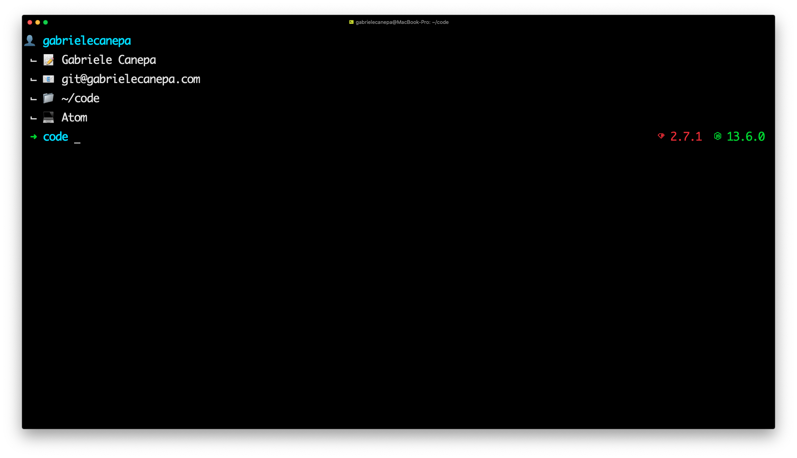
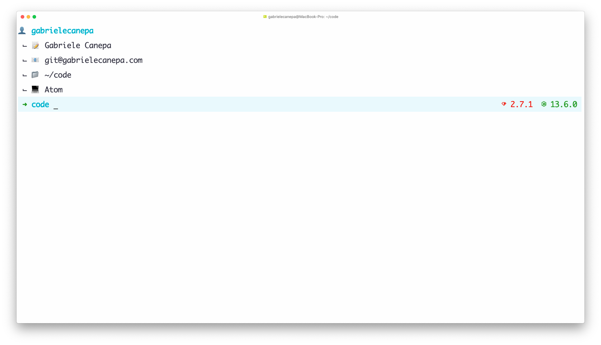
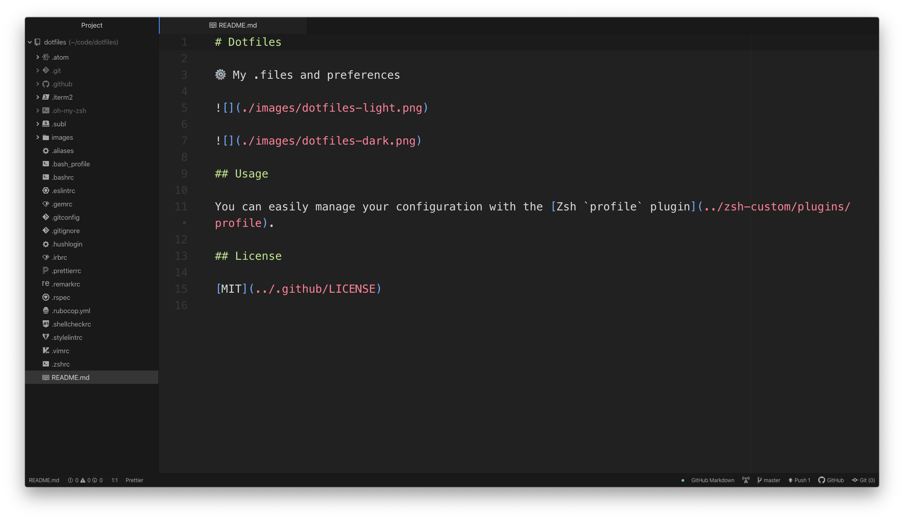
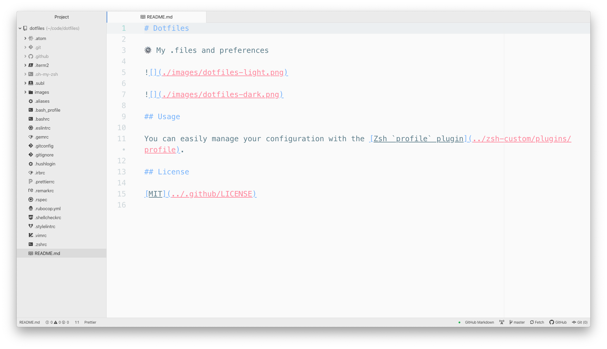
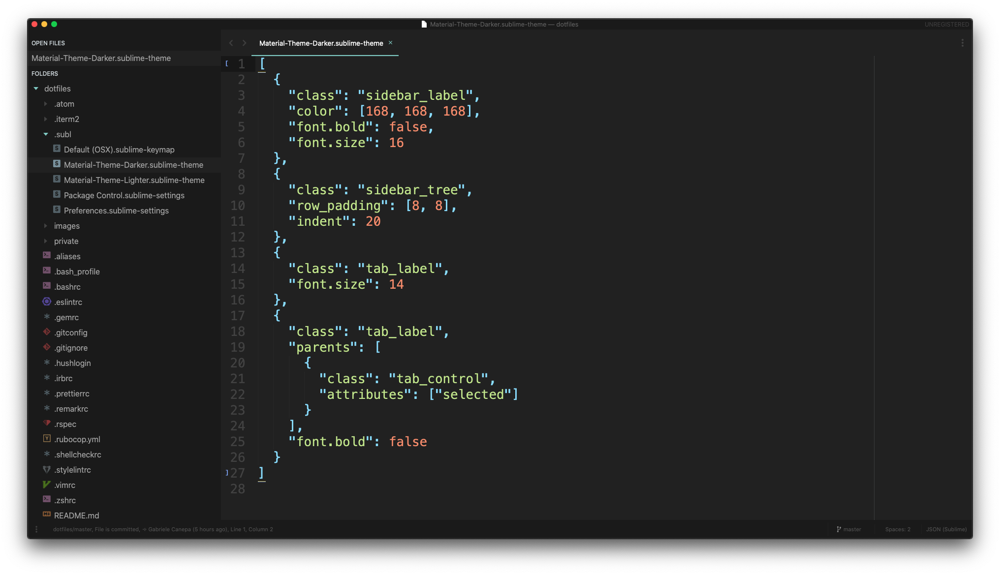
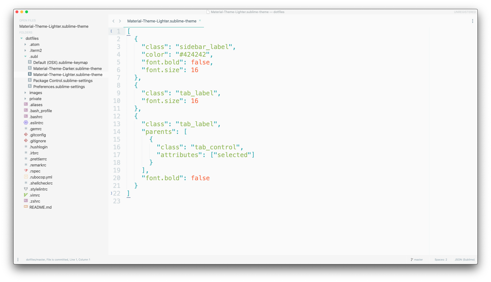

# Dotfiles

You can easily manage your own custom configuration with the [Zsh `profile`plugin](https://github.com/gabrielecanepa/zsh-custom/tree/master/plugins#profile).

## Shell

## Atom

## Sublime Text

## License

[MIT](https://github.com/gabrielecanepa/.github/blob/master/LICENSE)
